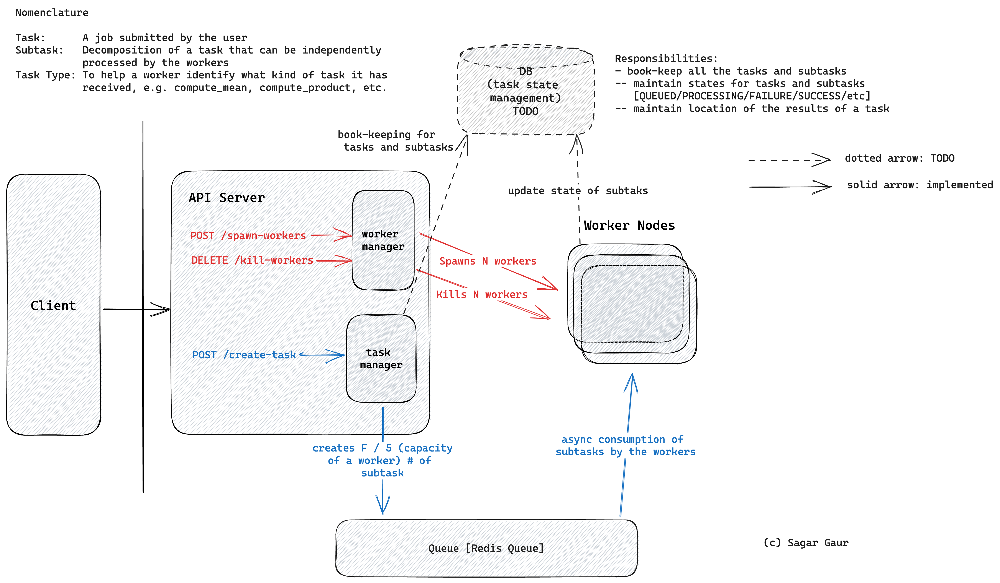

```

__________       .__                      .__                  .___
\______   \ ____ |__| _____ _____    ____ |__| ____   ____   __| _/
 |       __/ __ \|  |/     \\__  \  / ___\|  |/    \_/ __ \ / __ | 
 |    |   \  ___/|  |  Y Y  \/ __ \/ /_/  |  |   |  \  ___// /_/ | 
 |____|_  /\___  |__|__|_|  (____  \___  /|__|___|  /\___  \____ | 
___________    \/       .__/     \/_____/         \/     \/     \/ 
\_   _____/ ____   ____ |__| ____   ____                           
 |    __)_ /    \ / ___\|  |/    \_/ __ \                          
 |        |   |  / /_/  |  |   |  \  ___/                          
/_______  |___|  \___  /|__|___|  /\___  >                         
        \/     \/_____/         \/     \/                          

```

# Reimagined Engine

## Architecture




## Starting the API server

```bash
npx ts-node-dev src/api.ts
```
It would start a server at localhost:3000. 
API docs would be available in localhost:3000/api-docs

## Manually starting the Workers

```bash
pip install -r requirements.txt
python workers/start_worker.py
```

## Manually Posting a message in Redis

```bash
redis-cli LPUSH subtasks_queue "{\"task_type\": \"compute_mean\", \"payload\": {\"task_id\": \"task001\", \"subtask_id\": \"subtask_001\", \"file_paths\": [\"test1.csv\", \"test2.csv\", \"test3.csv\"], \"result_file\": \"result.csv\"}}"
```
